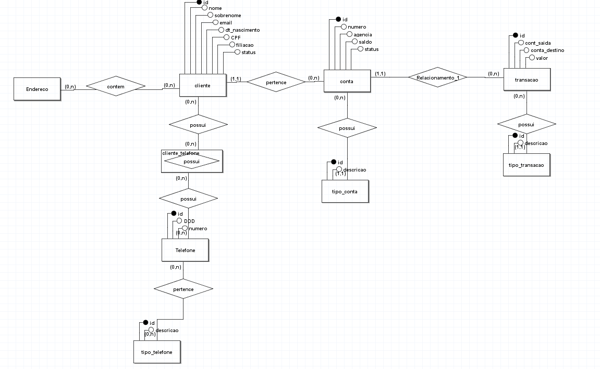
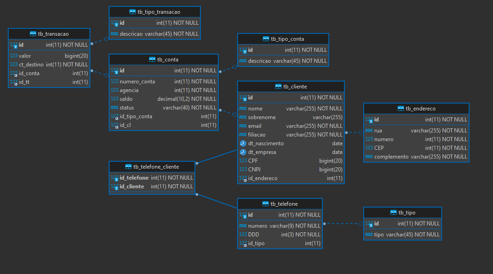

# Projeto Fintech

Com dedicação e conhecimento adquiridos no curso de Administrador de Bancos no SENAI, desenvolvi um projeto final de banco de dados que representa a excelência da nossa jornada acadêmica, demonstrando habilidades sólidas para gerenciar informações de forma eficiente e inovadora.

## Modelo conceitual

## Modelo Lógico

## Tabelas

* tb_endereco
* tb_cliente
* tb_tipo_telefone
* tb_telefone
* tb_cliente_telefone
* tb_tipo_transacao
* tb_transacao
* tb_tipo_conta
* tb_conta

## Views
* vw_cliente_info: Mostra todos os detalhes dos clientes
* vw_cliente_transacoes: Mostra todos as transações dos clientes

## Routines
* PROCEDURE sp_atualizar_cliente para a atualização de clientes
* PROCEDURE sp_atualizar_endereco para a atualização de endereco
* PROCEDURE procedure sp_atualizar_tipo_telefone para a atualização do tipo telefone
* PROCEDURE sp_atualizar_telefone para a atualização do  telefone
* PROCEDURE sp_atualizar_tipo_conta para a atualização do  tipo_conta
* PROCEDURE AtualizarSaldoCliente para a atualização da conta

## Triggers
* TRIGGER tr_adicionar_clientes  : Trigger para inserção de clientes
* TRIGGER tr_delete_clientes  : Trigger para deletar clientes
* TRIGGER tr_adicionar_endereço  : Trigger para inserção de endereço
* TRIGGER tr_delete_endereco  : Trigger para deletar endereço
* TRIGGER tr_adicionar_tipo  : Trigger para inserção de tipo telefone
* TRIGGER tr_delete_tipo  : Trigger para deletar de tipo telefone
* TRIGGER tr_adicionar_telefone  : Trigger para inserção de telefone
* TRIGGER tr_deletar_telefone  : Trigger para deletar de telefone
* TRIGGER tr_adicionar_tipo_numero  : Trigger para inserção de tipo 
* TRIGGER tr_adicionar_tipo_conta : Trigger para inserção de tipo conta
* TRIGGER tr_delete_tipo_conta : Trigger para delete de tipo conta
* TRIGGER tr_adicionar_conta : Trigger para inserção de conta
* TRIGGER tr_delete_conta : Trigger para deletar a conta
* TRIGGER tr_adicionar_tipo_transacao : Trigger para inserção do tipo_transação
* TRIGGER tr_delete_tipo_transacao : Trigger para deletar do tipo_transação
* TRIGGER tr_adicionar_transacao : Trigger para inserção da transação
* TRIGGER tr_delete_transacao : Trigger para deletar a transação

___________________________
| Scripts | **Clique aqui**|
| -       | -              |
| CREATE DATABASE AND TABLES | [Clique aqui](db_startup.sql)|
| -       | -              |
| INSERT | [Clique aqui](insert.sql)
| -       | -              |
| TRIGGERS,PROCEDURE,VIEW | [Clique aqui](trigger_procedures_view.sql)
____________________________

## Contatos

_____
 

_____
 
